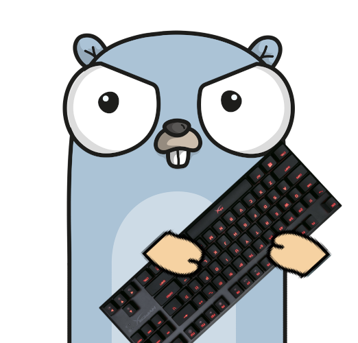
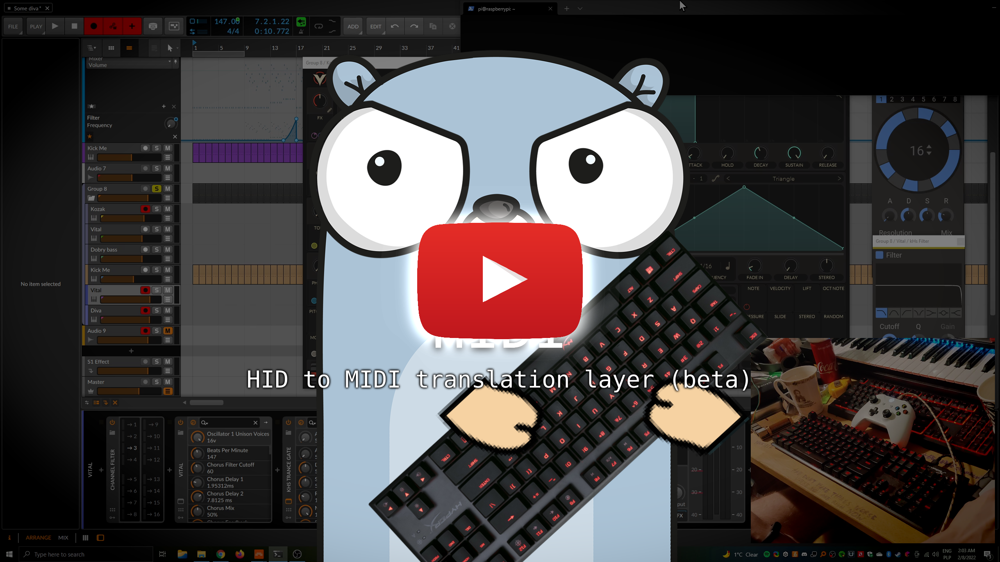
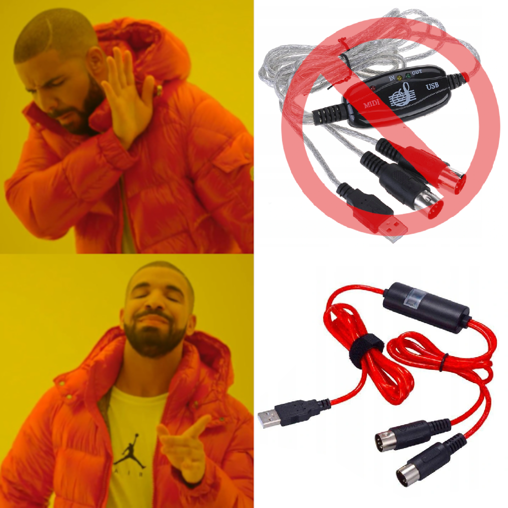

# HIDI

This is development branch, there is no guarantee that everything works correctly

Flexible HID to MIDI translation layer  
Ultimate successor of [keyboard2000](https://github.com/gethiox/keyboard2000)
and [keyboard3000](https://github.com/gethiox/keyboard3000) projects

Demo video:  

# What it is for?
HIDI is a translation layer between HID devices like keyboards or gamepads and hardware MIDI interface.  
This way you can play on your **computer keyboard as MIDI device**, use gamepad analog sticks to control
pitch-bend and CC. As many devices as you want, simultaneously.

Easy to use, easy to customize, and it has many quality of life features, carefully crafted with love to provide
the best user experience possible.

- Any number of **customized MIDI mappings**, switchable by dedicated key
  Piano, Chromatic and Control (every key with unique midi note) provided as default configuration
- Gamepad analog input to **control CC, pitch-bend** and note/action emulation
- Several actions like **octave** control (F1-F2), **semitone** (F3-F4), **mapping** (F5-F6), **channel** (F7-F8),
  **multi-note** (f9)
- Action pairs can be pressed at once to reset to default value
- Multi-note mode with one press of a button, hold any number of additional intervals and press F9
  Press again without holding any notes to disable multi-note mode
- **The best possible implementation of note emission**, user can freely change device state on the fly 
  (octave, semitone, mapping, channel) even while still pressing keyboard keys, due to careful design
  notes will be not interrupted, will be released correctly on key release and only new key presses will emit
  notes respectively to the new internal state. This is very pleasant feature when performing in realtime. 
- NKRO keyboards support (if it can be enabled in hardware by some key-sequence)
- You can connect as many HID devices as you have free USB slots. 
- **All devices are loaded/unloaded completely dynamically**
- Application will reload configuration when new one will appear, or existing one was changed.
  Very useful when user want to craft their own configuration, thanks to that he can test his modifications
  in realtime without unnecessary interruption like restarting application

# Significant improvements since beta release
- YAML configurations for devices. automatic reload
- Monitoring of input handlers is now a magnitude more efficient
- Graceful app termination
- greatly improved speed of application start and termination
- Fixed input device grabbing for exclusive usage
- CC learn action - easier way to learn CC with unstable analog input, also useful for multi-axis analog sticks
- Precompiled builds for various targets
- Embedded config directory, if config directory doesn't exist, application will create default one
- automatic update of factory configurations (if there are new ones or modified). hidi.config stays intact

# TODO
- improve throttling logic to the best possible solution
- proper logging with multi-level debug option
- Polish default configurations for keyboard and gamepad

# Nice to have
- Arpeggiator and note latch MIDI effects, MIDI clock sync
- Utilize mouse's relative input
- Gamepad analog deadzones and adjustable transform curve

## Wishlist (far future)
- Fully featured DAW controller plugins
- MIDI sequencer
- OpenRGB support - useful for both DAW controller and MIDI sequencer

# License
Project is released under **GPLv3**, for detailed information see [LICENSE](./LICENSE)

# Requirements
- **Application is designed to be run under a Linux machine**, 
- the most desirable choices are platforms like Raspberry Pi. It can easily run with one-core under Pi zero v1.
  However, there are no limits, it can be run on practically all Linux-supported platforms, including x86-64.
- In the case of Pi Zero, thing like USB HAT may be useful
- **decent MIDI interface**, please avoid cheap china USB interfaces, [it has problem with receiving data](http://www.arvydas.co.uk/2013/07/cheap-usb-midi-cable-some-self-assembly-may-be-required/)
  (unless you have old version lying around, it may work just fine). Here is my recommendation:
  
- If you don't have spare MIDI ports on your PC, two identical USB MIDI interfaces with some DIN 5p bridges may be useful
- **Keyboards**, **gamepads** :)

# Building
Just run `go run build.go`  
By default, it will build all defined platforms, to select specific one see `go run build.go -h` for usage

# Usage
Just place binary on your platform and run by `./HIDI`  
See `-h` flag for available optional arguments

- If necessary, add permission for execution with `chmod +x HIDI`
- If you're connected with wifi to your Pi, it may be useful to run it under **[tmux](https://github.com/tmux/tmux/wiki)**
  to avoid program termination on connection loss, just type `tmux` to run multiplexer, `ctr+b -> d` to leave tmux
  running in the backgroud, `tmux a` to re-enter your session
- During application use you probably don't want to propagate keyboard events into your system  
  To avoid that use `-grab` parameter  
  **Warning**: If you're starting application with your directly connected keyboard it may be impossible to terminate it
  in that case  
  Proper solution coming soon™
- Standard user may not have permission to read input devices directly for security reasons  
  The best way of running this program in userspace is to give temporary privilege to `input` group with:  
  `sudo -u your_username -g input ./HIDI`  
  Try to avoid running untrusted software directly with root privilege

Have fun!