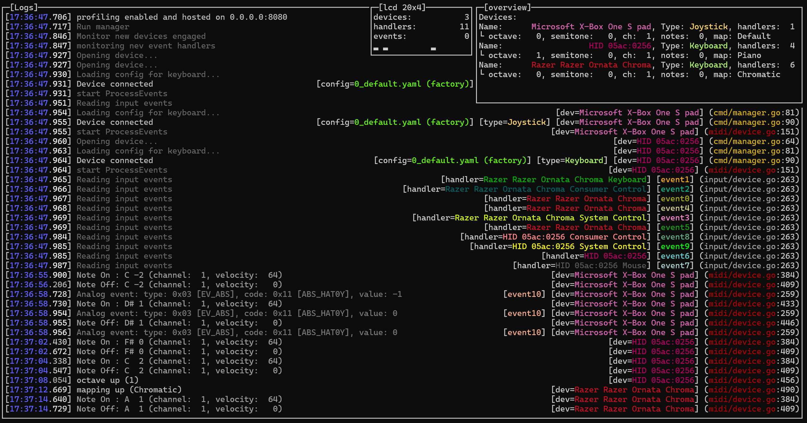

# HIDI

Flexible HID to MIDI translation layer

Demo video:  
  
Ultimate successor of [keyboard2000](https://github.com/gethiox/keyboard2000)
and [keyboard3000](https://github.com/gethiox/keyboard3000) projects

    

# improvements since beta release

- OpenRGB support for arm-v6/v7, arm64 and amd64 ([Demo](https://youtu.be/QF_z6LHcSkE))
  Check `Direct Mode` section [here](https://gitlab.com/CalcProgrammer1/OpenRGB/-/wikis/Supported-Devices#keyboards) for
  supported devices.  
  known issues:
  - it doesn't work well when there is more than 1 (one) RGB keyboard
- YAML configurations for devices. automatic reload on user configuration changes
- note collision handlers, see [guide](cmd/hidi/hidi-config/user/README.md) for details
- Monitoring of input handlers is now a magnitude more efficient
- Graceful app termination
- greatly improved speed of application start and termination
- Fixed input device grabbing for exclusive usage
- CC learn action - easier way to learn CC with unstable analog input, also useful for multi-axis analog sticks
- configurable deadzones for analog input
- analog events throttling
- improved overall performance when logging is disabled
- Precompiled builds for various platforms
- Embedded config directory, if config directory doesn't exist, application will create default one
- Automatic update of factory configurations (if there are new ones or modified).
- Support for optional HD44780 screen (20x4) for displaying statistics
- Relatively good default configurations for keyboards and gamepads
- informative and eye-candy debug/logging

# Purpose

HIDI is a translation layer between HID devices like keyboards or gamepads and hardware MIDI interface.  
This way you can play on your **computer keyboard as MIDI device**, use gamepad analog sticks to control
pitch-bend and CC. As many devices as you want, simultaneously.

Because it's just a standard MIDI device **you can use it with both PC/DAW environment
and hardware synthesizers**.

Easy to use, easy to customize, and it has many quality of life features, carefully crafted with love to provide
the best user experience possible.

- Any number of **customized MIDI mappings**, switchable by dedicated key,
  Piano, Chromatic and Control (every key with unique midi note, useful for DAW control) provided as default configuration
- Gamepad analog input to **control CC, pitch-bend** and note/action emulation
- Several actions like **octave** control (F1-F2), **semitone** (F3-F4), **channel** (F5-F6), **mapping** (F11-F12)
- Action pairs can be pressed at once to reset to default value
- **intelligent note emission logic**, user can freely change device state on the fly 
  (octave, semitone, mapping, channel) even while still pressing keyboard keys, due to careful design
  notes will be not interrupted, will be released correctly on key release and only new key presses will emit
  notes respectively to the new internal state.
- NKRO keyboards support (if it can be enabled in hardware by some key-sequence)
- You can connect as many HID devices as you have free USB slots
- **All devices are loaded/unloaded completely dynamically**
- Application will reload configuration when new one will appear or existing one was changed.
  Very useful when user want to craft their own configuration

# Requirements

- Dedicated machine with Linux
- The most desirable choices are platforms like Raspberry Pi. It can easily run with one-core under Pi zero v1.
  However, there are no limits, it can be run on practically all Linux-supported platforms.
- In the case of Pi Zero, USB HAT may be useful
- **Decent MIDI interface**, please avoid cheap china USB interfaces,
  [it has problem with receiving data](http://www.arvydas.co.uk/2013/07/cheap-usb-midi-cable-some-self-assembly-may-be-required/)
  (unless you have old version lying around, it may work just fine).
- If you don't have spare MIDI ports on your PC, two identical USB MIDI interfaces with some DIN 5p bridges may be useful
- **Keyboards**, **gamepads** :)

# Usage

Download the latest version from [releases](https://github.com/gethiox/HIDI/releases) for the platform of your choice.
Place binary on your system and run it with `./HIDI`.  
See `-h` flag for available optional arguments

- If necessary, add permission for execution with `chmod +x HIDI`
- If you're connected with wifi to your Pi, it may be useful to run it under **[tmux](https://github.com/tmux/tmux/wiki)**
  to avoid program termination on connection loss, just type `tmux` to run multiplexer, `ctr+b -> d` to leave tmux
  running in the backgroud, `tmux a` to re-enter your session
- During application use you probably don't want to propagate keyboard events into your system  
  To avoid that use `-grab` parameter  
  **Warning**: If you're starting application with your directly connected keyboard it may be impossible to terminate it
  in that case  
  Proper solution coming soon™
- ~~Standard user may not have permission to read input devices directly for security reasons.  
  The best way of running this program is to grant temporary privilege to `input` group with:  
  `sudo -u your_username -g input ./HIDI`  
  Try to avoid running untrusted software directly with root privilege~~
  Due to some other complications (e.g. OpenRGB root requirement), it's the easiest to run it with `sudo`.

# Configuration

There are two types of configurations:
- `hidi.config` - minor behavior settings
- device configurations, see [guide](cmd/hidi/hidi-config/user/README.md) for details.

Have fun!

## Development

### Building

Make sure you have `go >= 1.18` installed  
Just run `go run build.go`  
By default, it will build all defined platforms without OpenRGB support,
to select specific platforms or enable OpenRGB, see `go run build.go -h` for usage

### Wishlist

Features that are possible to achieve. With enough interest and support I may be motivated to implement these.

- Utilize relative mouse input
- configurable modifier key/keys for expanded mapping (key sequence like `modifier+KEY_A`)
- localhost mode for Linux users without requirement of separate machine (jack/alsa)
- default device state in specific device configuration (octave, semitone, channel, mapping)
- Network MIDI
- Bluetooth MIDI device
- Arpeggiator (with MIDI clock sync), note latch, multinote MIDI effects
- Fully featured DAW control plugins
- standalone, fully featured **MIDI sequencer** with internal and external midi input support.
  Ideal feature for OpenRGB devices.

Do you like some specific idea listed above? Have you some improvement/feature idea not listed here?  
Feel free to leave your wishes in `Discussions` section!

# Contribution

Any kind of help is highly appreciated!  

### Features

You can propose features and improvements. There is no guarantee that I'm going to implement it right-away.
It depends on the complexity of given feature and overall integrity with the rest of application,
it depends on my free time and free will as well.

### Bugs

If you faced a bug, instability or general problems with application, feel free to open issue
and provide some information like error messages and logs.  
In the case of problems with your specific HID devices,
please provide the full content of `/proc/bus/input/devices` file and your platform.

### Code

Feel free to open pull requests.

### Configurations

If your keyboard doesn't work correctly with default configuration,
create your own and add it in a pull request as `Factory` configuration.
Make sure it has proper values in `Identifier` section and loads correctly.  
For more information, see [guide](cmd/hidi/hidi-config/user/README.md)

Please make sure that all default mappings are working and arranged correctly.
(Piano, Chromatic, Control - this one covers all keyboard keys with unique notes).    

### My questions

- Negotiating/enabling N-Key Rollover keyboard mode from the OS side. Currently, NKRO is supported for devices that
  have ability to enforce that with a key combination. If you may have an idea how to do it, please lave your answer
  [here](https://unix.stackexchange.com/questions/675933/keyboard-input-n-key-rollover).

# License

Project is released under **GPLv3**, for detailed information see [LICENSE](./LICENSE)

# Support

If you like my project, appreciate my time and effort and most importantly you had a lot of fun with it,
consider supporting it by `Sponsor` GitHub button.
